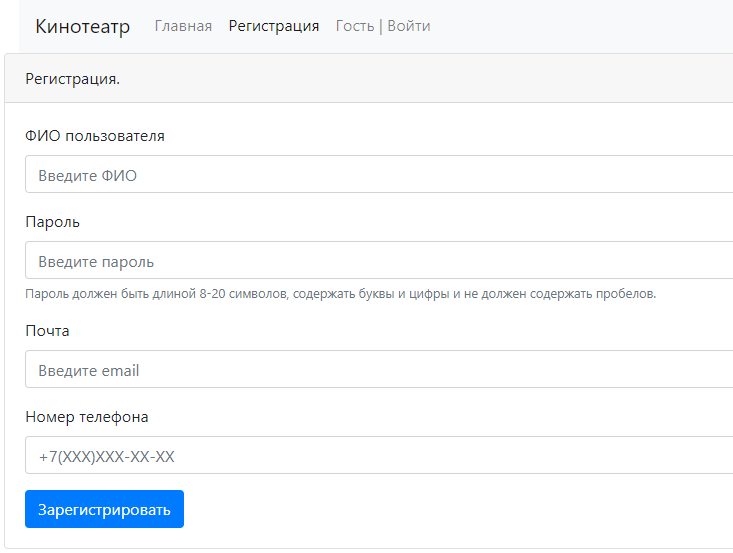

# job4j_cinema

### Описание проекта:
Приложение представляет из себя модель сайта кинотеатра. 
В приложении реализованы функции:
- регистрация пользователя;
- выбор сеанса кинофильма;
- выбор места в зале сеанса;
- резервирование места.

Приложение реализовано на основе паттерна MVC. Имеет три слоя Controller, Service, Persistence.

### Применяемые технологии: 
- Spring boot 2.7;
- Thymeleaf;
- Bootstrap 4;
- JDBC;
- Liquibase 3.6.

### Требования к окружению: 
- Java 17;
- Maven 3.8;
- PostgreSQL 12.

### Запуск проекта:
- Настроить окружение и подключение к серверу БД.
- Создать базу данных, например через утилиту psql:
``` 
create database cinema
``` 
- Упаковать проект в jar архив. Для этого выполнить:
``` 
mvn package
```
- Запустить приложение командой:
```
java -jar job4j_cinema-1.0-SNAPSHOT.jar
```

### Взаимодействие с приложением:
*регисатрация ...*



*авторизация ...*


*выбор сеанса ...*


*выбор ряд и мест ...*


*бронирование билета ...*


---

### Контакты
email: [ivan.turutin@gmail.com](mailto:ivan.turutin@gmail.com)